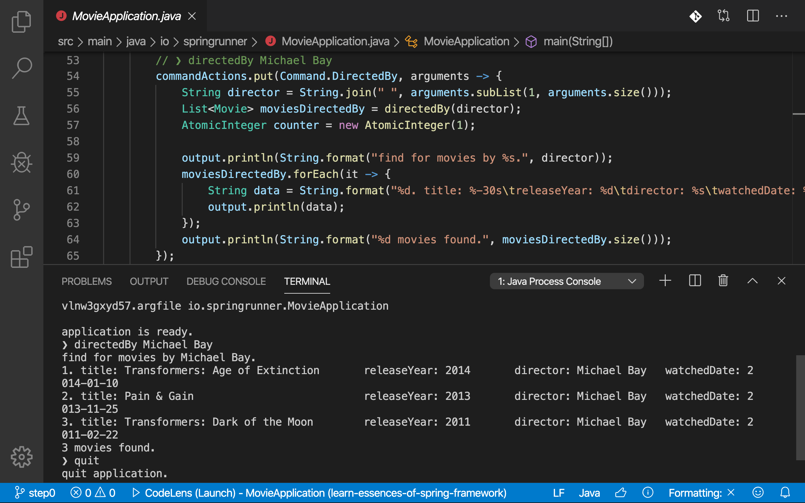

본 워크숍은 스프링 프레임워크의 기본 기술이자 핵심 개발 원칙인 `제어의 역전(IoC)과 의존관계 주입(DI)`을 이해하고, 더 나아가 스프링 3대 핵심 기술인 `스프링 IoC 컨테이너와 빈, 관점지향 프로그래밍, 이식 가능한 서비스 추상화`를 학습하는 워크숍입니다. 참가자는 스프링 핵심 기술과 함께 소프트웨어 설계 원칙, 디자인 패턴을 배울 수 있고, 이를 응용해 **변경에 유연하게 대응할 수 있는 애플리케이션** 개발을 경험할 수 있습니다.

### 목표

* 제어의 역전(IoC)과 의존관계 주입(DI)을 학습합니다.
* [스프링 IoC 컨테이너와 빈(Spring IoC Container and Beans)](https://docs.spring.io/spring/docs/current/spring-framework-reference/core.html#beans)을 학습합니다.
  - 스프링 IoC 컨테이너 생성과 소멸하는 방법을 다룹니다.
  - 빈(Beans) 등록 및 관리 방법을 다룹니다.
* [관점지향 프로그래밍(Aspect Oriented Programming, AOP)](https://docs.spring.io/spring/docs/current/spring-framework-reference/core.html#aop)을 학습합니다.
  - 관점지향 프로그래밍의 원리를 학습합니다.
  - 자바 코드로 직접 AOP를 다루는 방법을 학습합니다.
  - 스프링이 제공하는 AOP 모듈을 다루는 방법을 학습합니다.
* [이식 가능한 서비스 추상화(Portable Service Abstraction)](https://docs.spring.io/spring/docs/current/spring-framework-reference/integration.html#spring-integration)를 학습합니다.
  - 서비스 추상화의 배경과 개념을 학습합니다.
  - 스프링이 제공하는 PSA를 다루는 방법을 학습합니다.
* 소프트웨어 복잡성 이해하고, 복잡성을 다루는 몇 가지 설계 원칙과 디자인 패턴을 학습합니다.

### 학습자료 및 환경

워크숍 과정에서 사용하는 JVM 플랫폼 및 프레임워크, 라이브러리와 도구는 아래와 같습니다.

* Java SE 11 및 Java EE 8을 사용합니다.
* [Spring Framework 5.x](https://spring.io/projects/spring-framework)를 사용합니다.
* 빌드 도구로 [그레이들(Gradle)](https://gradle.org)을 사용합니다.
* [IDE](https://ko.wikipedia.org/wiki/통합_개발_환경)는 [Spring Tool Suite](https://spring.io/tools)를 사용합니다.

### 진행방식

  

순수 자바로 작성된 [콘솔 애플리케이션](https://en.wikipedia.org/wiki/Console_application)에 스프링 프레임워크를 도입하고, 리팩토링을 통해 점진적으로 코드를 개선합니다. 가이드 러너가 라이브 코딩과 함께 리팩터링 목적과 스프링 기술을 설명해주면, 참가자는 해당 코드를 직접 작성하고 실행-테스트하는 과정을 반복하는 방식으로 진행됩니다.

### 참가대상 및 준비물

* 본 워크숍은 자바(Java) 언어의 특징과 문법을 이해하고 사용할 줄 아는 분을 대상으로 합니다.
* 참가자는 Java SE 11과 Spring Tool Suite가 설치된 개인 노트북을 지참해야 합니다.

### 참가신청

- 본 워크숍은 **유료**로 **사전 신청 및 결제** 후 참여할 수 있습니다.
- 신청 및 결제는 [페스타(Festa)](https://festa.io)를 통해 할 수 있습니다.

### 참가취소 및 환불 정책
- **마감전 취소/환불**은 페스타에서 할 수 있습니다.
    - <small>참가 취소/환불 규정은 페스타 약관에 따라 처리됩니다.</small>
    - <small>참가비의 100%가 환불됩니다.</small>
- **마감후 취소/환불**은 메일(springrunner.kr@gmail.com)로 신청해야합니다.
    - <small>메일 내용에 은행 / 환불계좌 / 계좌주 / 연락처 / 페스타 아이디를 작성해 보내야합니다.</small>
    - <small>참가비의 50%가 환불됩니다. (교육장 계약 비용으로 인한 점 양해바랍니다)</small>

### 워크숍 일정

이 워크숍은 2020년 3월 중 개설될 예정입니다.

