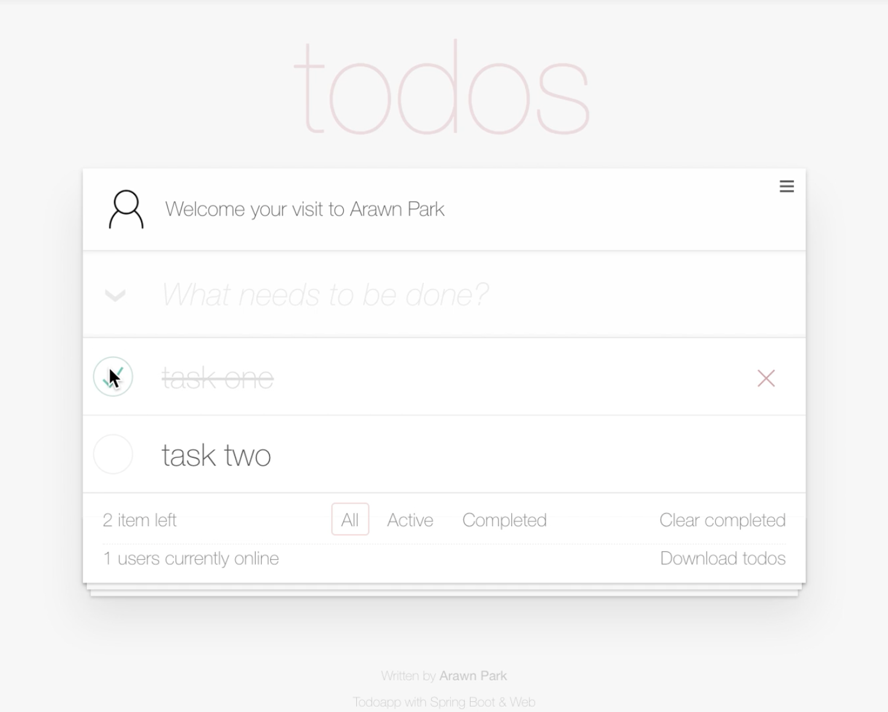

본 워크숍은 [Spring MVC](https://docs.spring.io/spring/docs/current/spring-framework-reference/web.html)와 [Spring Boot](https://spring.io/projects/spring-boot)로 웹 애플리케이션 서버 사이드(Server-side)를 직접 개발하며 학습하는 워크숍입니다. 참가자는 Spring MVC의 핵심인 HTTP 요청 연결, 데이터 바인딩, 응답 및 예외 처리 방법을 배우고 경험 할 수 있습니다.

* Spring MVC와 Spring Boot가 제공하는 다양한 웹 기능을 학습할 수 있습니다.
* 웹 애플리케이션에 서버 사이드 전체를 개발해보는 경험을 할 수 있습니다.
    - 프론트엔드 엔지니어와 협업하며 프로젝트를 수행하는 것과 유사한 경험을 할 수 있습니다.
    - 보편적인 웹 애플리케이션 아키텍처를 엿볼 수 있습니다.
* 라이브 코딩과 설명, 실습으로 16시간(하루 8시간, 이틀간) 동안 진행됩니다.

### 목표

* Spring MVC의 구조와 아키텍처를 살펴봅니다.
  - Spring Boot가 제공하는 웹 기능도 함께 살펴봅니다.
* HTTP 요청을 연결하는 방법을 학습합니다.
  - URL과 HTTP Method, Header 등 사용해 연결하는 방법을 다룹니다.
  - 정적 자원(css, image, javascript)을 연결하는 방법을 다룹니다.
* HTTP 요청시 클라이언트(브라우저)가 전송한 데이터을 다루는 방법을 학습합니다.
  - HTML 폼, JSON 페이로드, 파일 등 다양한 요청 데이터를 다룹니다.
* 요청 처리 결과를 클라이언트(브라우저)에게 응답하는 방법을 학습합니다.
  - HTML 또는 JSON, 파일 컨텐트를 다룹니다.
* 요청 및 응답 처리 과정에서 발생한 예외를 처리하는 방법을 학습합니다.
  - 오류 페이지와 메시지를 처리하는 방법을 다룹니다.
* 요청과 응답에 대해 전처리 또는 후처리 방법을 학습합니다.
  - 사용자 인증과 인가 또는 로깅 등 처리 방법을 다룹니다.
* [i18n](https://en.wikipedia.org/wiki/Internationalization_and_localization)을 위한 메세지 다국어 처리 방법을 학습합니다.

### 학습자료 및 환경

워크숍 과정에서 제공되는 학습 자료 중 일부를 [링크](https://github.com/springrunner/learn-spring-web-programming)를 통해 볼 수 있습니다. 그리고 사용하는 JVM 플랫폼 및 프레임워크, 라이브러리와 도구는 아래와 같습니다.

* Java 1.8.x 및 Java EE 7을 사용합니다.
* [Spring MVC 5.x](https://spring.io/projects/spring-framework), [Spring Boot 2.x](https://spring.io/projects/spring-boot)를 사용합니다.
* 빌드 도구로 [그레이들(Gradle)](https://gradle.org)을 사용합니다.
* [IDE](https://ko.wikipedia.org/wiki/통합_개발_환경)는 [Spring Tool Suite](https://spring.io/tools)를 사용합니다.

### 진행방식

참가자는 제공되는 애플리케이션 정의서와 Web API 정의서, 그리고 [웹 클라이언트](https://github.com/springrunner/todoapp-client)로 할 일 관리 웹 애플리케이션(todos)에 서버 사이드를 개발합니다.

  

가이드 러너가 라이브 코딩과 함께 Spring MVC(또는 Spring Boot)에 기능을 설명해주면, 참가자는 해당 코드를 직접 작성하고 실행-테스트 하는 과정을 반복하며 완전한 웹 애플리케이션을 개발해보는 방식으로 진행됩니다.

### 참가대상 및 준비물

본 워크숍은 자바(Java)와 웹(Web)에 대한 이해가 있는 분을 대상으로 합니다.

* 자바(Java)에 언어 특징과 문법을 이해하고 사용할 줄 알아야 합니다.
    * 서블릿(Servlet)에 대해 이해도가 있으면, 워크숍 과정에서 좀 더 많은 것을 얻을 수 있습니다.
* [HTTP](https://www3.ntu.edu.sg/home/ehchua/programming/webprogramming/HTTP_Basics.html)에 대한 기본 지식과 이해가 필요합니다.
    - 요청(Request)과 응답(Response)이라는 웹 처리 흐름에 대한 이해가 있어야 합니다.
    - HTTP 헤더, 쿠키, 세션, 상태코드 등에 대한 이해가 있어야 합니다.
    - [미디어타입(Media Type)](https://en.wikipedia.org/wiki/Media_type)에 대해 이해도가 있으면, 워크숍 과정에서 좀 더 많은 것을 얻을 수 있습니다.
* 웹 기술(HTML, CSS, JavaScript)에 대해 이해도가 있으면, 워크숍 과정에서 좀 더 많은 것을 얻을 수 있습니다.

참가자는 Java 1.8.x와 Spring Tool Suite가 설치된 개인 노트북을 지참해야 합니다.

### 참가신청 및 비용

- 본 워크숍은 **유료**로 **사전 신청 및 결제** 후 참여할 수 있습니다.
- 신청 및 결제는 [페스타(Festa)](https://festa.io)를 통해 할 수 있습니다.
- 참가비는 30만원이며, 참가비의 15%는 **오픈소스 기부활동**으로 사용됩니다.
    * <small>**참가비 할인 행사**가 진행되고 있습니다.</small>
    * <small>할인 행사시 기부 활동으로 이어지지 않습니다.</small>

### 참가취소 및 환불 정책
- **마감전 취소/환불**은 페스타에서 할 수 있습니다.
    - <small>참가 취소/환불 규정은 페스타 약관에 따라 처리됩니다.</small>
    - <small>참가비의 100%가 환불됩니다.</small>
- **마감후 취소/환불**은 메일(springrunner.kr@gmail.com)로 신청해야합니다.
    - <small>메일 내용에 은행 / 환불계좌 / 계좌주 / 연락처 / 페스타 아이디를 작성해 보내야합니다.</small>
    - <small>참가비의 50%가 환불됩니다. (교육장 계약 비용으로 인한 점 양해바랍니다)</small>

### 워크숍 일정

2020년도 워크숍 일정은 준비 중 입니다.

### 워크숍 이력

###### ~~Done: Mastering Spring Web 101 Workshop (6th)~~
- <small>일정: 2019년 11월 23일 10:00 ~ 19:00 / 11월 24일 10:00 ~ 19:00</small>
- <small>장소: 서울특별시 강남구 논현로105길 10 2층, 펀에듀스페이스</small>
- <small>인원: 8명</small>

###### ~~Done: Mastering Spring Web 101 Workshop (5th)~~
- <small>일정: 2019년 10월 19일 10:00 ~ 19:00 / 10월 26일 10:00 ~ 19:00</small>
- <small>장소: 서울특별시 강남구 논현로105길 10 2층, 펀에듀스페이스</small>
- <small>인원: 5명</small>

###### ~~Done: Mastering Spring Web 101 Workshop (4th)~~
- <small>일정: 2019년 9월 7일 10:00 ~ 19:00 / 9월 8일 10:00 ~ 19:00</small>
- <small>장소: 서울특별시 강남구 테헤란로4길 6, 마이워크스페이스 1호점 컨퍼런스룸</small>
- <small>인원: 11명</small>

###### ~~Done: Mastering Spring Web 101 Workshop (3rd)~~
- <small>일정: 2019년 8월 24일 10:00 ~ 19:00 / 8월 25일 10:00 ~ 19:00</small>
- <small>장소: 서울특별시 강남구 논현로105길 10 2층, 펀에듀스페이스</small>
- <small>인원: 13명</small>

###### ~~Done: Mastering Spring Web 101 Workshop (2nd)~~
- <small>일정: 2019년 7월 20일 ~ 2019년 7월 21일</small>
- <small>장소: 서울특별시 강남구 논현로105길 10 2층, 펀에듀스페이스</small>
- <small>인원: 11명</small>

###### ~~Done: Mastering Spring Web 101 Workshop (1st)~~
- <small>일정: 2019년 2월 16일 ~ 2019년 2월 17일</small>
- <small>장소: 서울특별시 강남구 강남대로62길 23 4층, 코드스쿼드</small>
- <small>인원: 10명</small>

